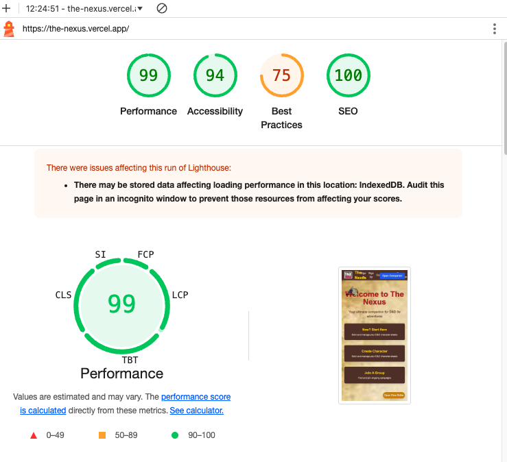

# The Nexus a D&D Campaign Companion and Compendium

## The Team

- Alex Buck
- Anthony Ricketts
- Thomas Harvey
- Nicky Mortoza-Cowles

## Project Description

### Problem Domain

D&D Beyond is excellent for managing campaigns but lacks offline functionality and collaborative features for campaign notes.
Improvement:
-Add an offline mode for campaign access without the internet and real-time collaborative note-taking for players and DMs.

-Paywall puts beginners of from use so free at point of use.

-Create Groups- for those that have simalar interests or who play together regularily etc or a group for Dungeon Masters etc.

-Moderation- Groups can set expectations

-Age specific enviroments for age

## MVP User Stories

- As a user, I want to be able to register or login securely and my details to be stored so that I can edit my profile.

- As a user, I want to be able to build my DnD profile to display details about myself (some suggestions are: age, game experience, game play preferences, character list, if I am a DM and show active games and groups I am involved in).

- As a user, I expect to be able to create DnD characters which can then be saved and associated with my profile,

- As a new user, and new to DnD I would like the website to be inuitive and easy to navigate so that I can access the rules of play and resources needed to play via a user freindly compendium where ever I am on the web app.

- As a user, with experience with DnD I want to be able to join groups so there is a record of our games which shows who is the DM and a list of all players in that game.

- As a user, I would like to be able to use online dice as part of the game play.

## Stretch Goals for Product

- As a user, I want to be able to edit and delete my characters.

- As a player, I want to navigate the website easily to find likeminded players and DMs so I can start playing quickly via a message board for the group, its players and the DM.

- As a user, if I am a DM I expect to be able to save the source material including maps, monsters and notes which I can then edit and delete as needs be.

- As a user, I want to be able to download my characters, maps and resources so I can print them and play offline if I choose to.

- As a player, expect the web app to be moderated by admins ensuring safe play and a standard set of predefined rules for online conduct.

- As a user, I want to be able create a group where the DM can be defined as well as players and the ability to communicate with the group.

## Wireframe

## How to use

Link to site https://the-nexus.vercel.app/

Navigating the Site

1. Homepage:
   • Start your journey by landing on the homepage, where
   you’ll see the latest updates and quick links to key sections of the
   app.
2. Character Management:
   • Access this section to create new characters or manage
   existing ones.
   • Each character profile includes stats, abilities, and other
   relevant D&D details.
   • You can edit or delete characters as needed.
3. Compendium:
   • Browse through a comprehensive library of spells,
   monsters, and equipment.
   • Use the search functionality to quickly find specific entries.
4. User Profile:
   • Sign in or sign up using Clerk’s secure authentication
   system.
   • View your personal profile, including your characters and
   saved resources.
5. Responsive Design:
   • The app is optimized for both desktop and mobile users,
   ensuring a seamless experience across devices.
   Key Functionalities
   • Creating a Character:
   • Navigate to the character section and click on “Create New
   Character.”
   • Fill in the necessary details and save your character.
   • Viewing the Compendium:
   • Go to the compendium section to access game resources.
   • Filter resources by type (e.g., spells, monsters, items).
   • Editing/Deleting:
   • Manage your characters and remove outdated profiles or
   incorrect entries directly from the character management page

## Lighthouse Report

## Reflections

Please mention the requirements you met and which goals you achieved for this assignment.
TH: We have achieved our MVP and most features are working as intended, however there are a few flaws.
NMC : We achieved our MVP once we reduced the scope. There are some issues liek redirects etc, which will be something we investigate as time develops 
🎯 Were there any requirements or goals that you were not quite able to achieve?
TH: Due to the large scope and complexity of our MVP, even after we cut it down a couple of times, we were working on it right up to the coding deadline and had no chances to work on any of the stretch goal or fix the bugs present in the MVP.
NMC: JSUt our stretch gals and the minor bugs. 

🎯 If so, could you please tell us what was it that you found difficult about these tasks?
TH: Because of new techniques used in the database and how disorginised the code was when creating types and domains it was difficult to explain how the database works to my teammates.
NMC: I found the keeping contrtol of my on gradiose need to succeed complicated so muc hfor everyone.

What went really well and what could have gone better?
NMC: the compendium and adding to it i ws so proud off as well as the logic for the dice roller.

Detailing useful external sources that helped you complete the assignment (e.g Youtube tutorials).
NMH: GEEKs  for Geeks, W£Schools, CODECADEMY, various youtube and our amazing teachers 
Describing errors or bugs you encountered while completing your assignment.

References:
Third-party APIs, CSS resets, icons, images...
